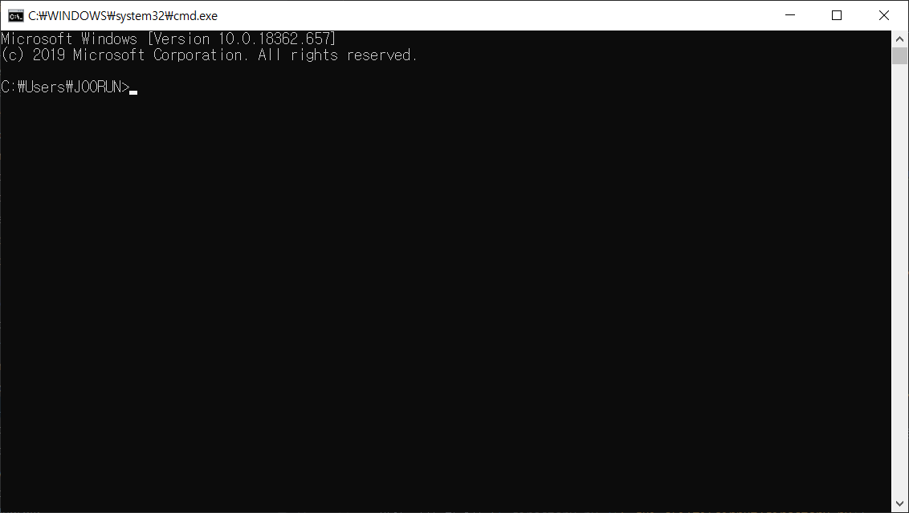
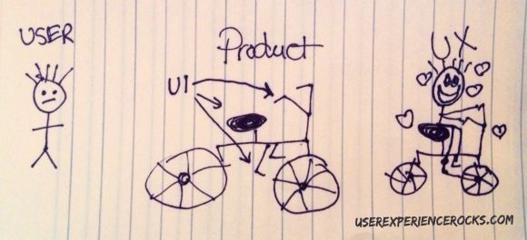
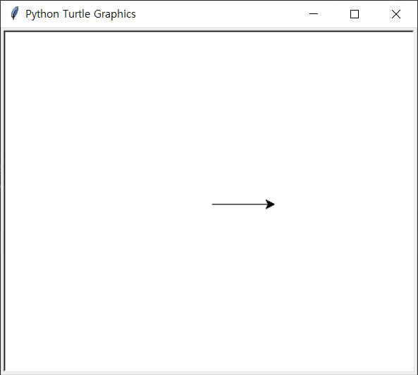

# 내 눈에 보이는 화면 + 마우스 없이 파일 다루자 
~~아놔 최강민 똥멍청이가 파일 연결 제대로 안해놨네~~
+ GUI와 CLI의 비교 및 파일 열고닫기(개념) + `turtle`, `pygame`, `tkinter`(개념) + [`pysnake`](5.gui,cli+fileinput/pysnake.py) (실습)

  ## GUI vs CLI

  __G__ raphic __U__ ser __I__ nterface  
  그리고  
  __C__ ommand __L__ ine __I__ nterface  
  우선 CLI에 대한 설명부터 먼저 하지 않을 수 없는데, 이는 우리가 정~~~말 가끔 썼던 cmd창  
    
  이것이 가장 대표적인 CLI라 할 수 있겠다. 또한 아마 수업 진행을 pycharm으로 할 텐데, 거기의 Terminal도 CLI라고 할 수 있다. 여태 수업을 진행해오면서 느꼈겠지만, Command를 Line으로 받는 Interface이기 때문에 CLI라고 하는 것이다.  
  그렇다면 '지-유-아이' 라고 읽기도 하고 '구이'라고 읽기도 하는 GUI는 무엇이냐? 대표적인 예로는 윈도우 운영체제를 들 수가 있겠다. Graphic을 활용한 User Interface이기 때문에 GUI라고 하나보다.  
  정리 : GUI = CLI + 그래픽
  
  ## UX vs UI
  __U__ ser e __X__ perience  
  그리고  
  __U__ ser __I__ nterface  
    
  UI는 사람(사용자)이 앱을 사용할 때 마주하는 기술적인 부분들이고, UX는 이 앱을 사용하는 과정에서 느끼는 경험, 감정, 느낌, 태도 등이다. 위의 그림을 예시로 들자면, USER가 자전거를 탈 때 사용하는 페달, 안장, 손잡이 등은 UI, 자전거를 탈 때 '아 기분조아!'라고 하는 것은  UX에 해당이 될 것이다.  
  예시를 하나 더 들어보자면.. 예를 들어 '수달'이라는 앱을 만들어 배포한다고 치면, 이것을 Google Play에 올릴 것인가? 혹은 직접 .apk 파일을 배포할 것인가? 부터 시작해서 앱의 디자인, 터치감, 기능성 등을 User가 사용하면서 느낄 것들을 고려하는 것이 UX 디자인이라고 할 수 있겠다.  
  ~~사실 적당히 말로 때우면 된다~~
  
  ## turtle이란?
  참고문헌 - [24. Program Frameworks - Python 3.3.7 documentation](https://docs.python.org/3.3/library/frameworks.html)  
    
  ~~귀여운 거북이~~  
  거북이..를 이용해서 아이들, 혹은 초심자에게 프로그래밍과 친해질 수 있도록 하는 모듈이다. 모듈이라는 어려운 말이 나왔다고 당황할 것 없이 그냥 기능이라고 치환해서 이해해도 괜찮을 것이다.  
  기본적인 문법 구문은 다음과 같다.  
  ```
  import turtle as t
  
  t.forward(70)
  ```  
    
  위의 코드를 실행한 모습이다. 70픽셀만큼 앞으로 가라고 명령했는데, 각도 전환, 펜 색깔, 배경 색깔, 회전, 원 그리기 등 많은 명령어(메소드)들이 있기 떄문에 구글링이나 참고문헌을 참조하면 좋을 듯 하다.  
  
  
  ## pygame이란?  
  [About - wiki](https://www.pygame.org/wiki/about)

  - `tkinter` 이란?  티킨터라고 읽는다
  [tkinter - Python interface to Tcl/Tk - Python 3.8.1 documentation](https://docs.python.org/ko/3/library/tkinter.html)
  - [playsnake](https://python.bakyeono.net/chapter-12-1.html)를 통한 게임 만들기
    [파이썬으로 뱀 게임 만들기](https://python.bakyeono.net/chapter-12-1.html) 참조해 코드 완성하자

+ 파일 입출력,`csv`에 대한 이해(개념) + 파일 입출력(실습)

  - 파일 위치 및 경로([`directory.py`](5.gui,cli+fileinput/directory.py))
  - 파일 입력([`write_txt.py`](5.gui,cli+fileinput/write_txt.py)) + `with`(context manager)
  - 파일 출력([`read_txt.py`](5.gui,cli+fileinput/read_txt.py)), 수정([`reverse_content.py`](5.gui,cli+fileinput/reverse_content.py))
  - [`Escape Sequence`](5.gui,cli+fileinput/escape_sequence.py)
  - `csv` 파일 구조 방식([`csv_format.py`](5.gui,cli+fileinput/csv_format.py))
  - `csv`파일 출력([`write_csv.py`](5.gui,cli+fileinput/write_csv.py)), `csv` 파일 입력([`read_csv.py`](5.gui,cli+fileinput/read_csv.py))
