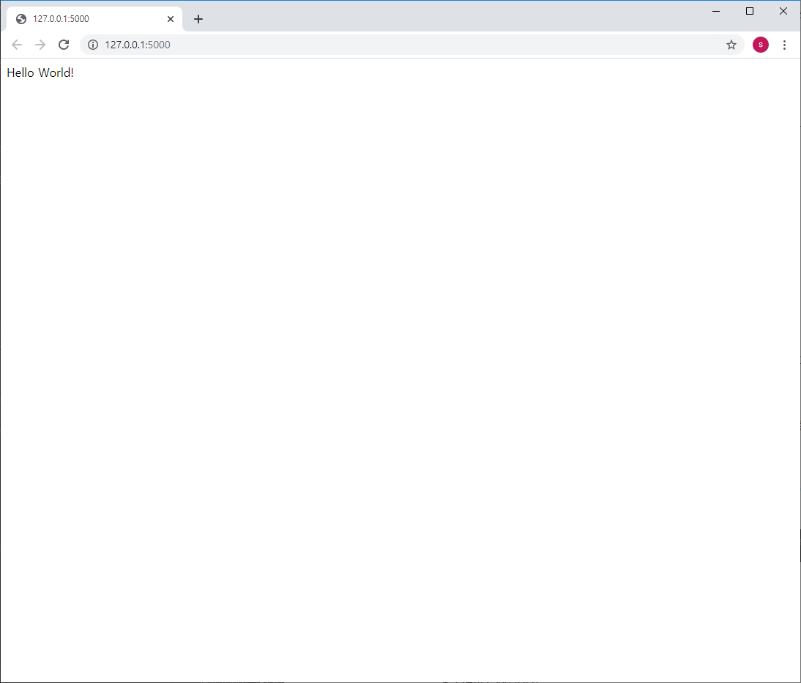
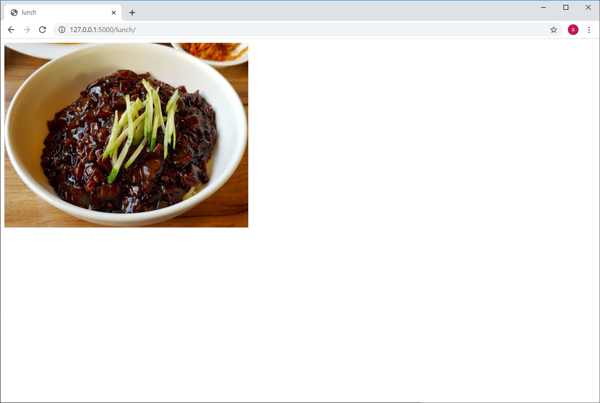

# 남이 만든 코드를 재사용하자 

## 라이브러리 vs 프레임워크
    
    
    
    
    
## flask + 실습(오늘 점심 뭐먹지)  

### flask란?

**flask** 란 파이썬 언어 기반의 **마이크로(micro)** 프레임워크입니다. 마이크로 라고 해서 기능적으로 부족하다는 뜻이 아니라, 핵심 기능만 유지하면서 확장 가능하다는 의미입니다.
<br>가장 널리 쓰이는 파이썬 웹 프레임 워크인 Django와 비교하자면, Django는 강력하고 풍부한 기능을 제공하지만 복잡하고, flask는 핵심 기능만 제공하기 때문에 가볍고 자유도가 높습니다. 웹에 필요한 기능들은 확장모듈을 사용하여 구현할 수 있습니다.


### flask로 홈페이지 만들기

우선 파이참 프로젝트를 생성한 후 flask를 설치합니다.

```
$ pip install flask
```

프로젝트 폴더에 `lunch.py` 파일을 만들고 아래와 같이 코드를 입력합니다.


```python
from flask import Flask  # Flask 모듈을 import해서 사용

# 플라스크 객체 생성
app = Flask(__name__)

@app.route("/")  # URL과 함수 매칭
def hello():
    return "Hello World!"

if __name__ == "__main__":
    app.run()
```

터미널 창에 다음과 같이 입력하여 서버를 켜봅시다. 
```
$ python lunch.py
```

터미널 창에 다음과 같이 출력되면 서버가 켜진 것입니다.


그다음 [http://127.0.0.1:5000/](http://127.0.0.1:5000/) 링크를 클릭하여 홈페이지를 확인해봅시다.



<!--
이번엔 서버가 켜져있는 상태로 화면에 표시된 값을 수정해보겠습니다. `hello`함수의 return값을 변경 후에 페이지를 새로고침 해봅시다.
```python
...

@app.route("/")  # URL과 함수 매칭
def hello():
    return "Hello Haedal!"

...
```

return값을 "Hello Haedal!"로 변경했는데도 페이지에 변경사항이 적용되지 않은것을 확인할 수 있습니다.
<br>`Ctrl+C`를 이용하여 서버를 종료한 후 디버그 모드를 활성화 시켜봅시다.

```
...

if __name__ == "__main__":
    app.run(debug=True)
```

-->

### 오늘 점심 뭐먹지

메뉴를 골라 해당하는 음식 사진을 보여줍니다
<br>`static` 폴더를 만들고, 원하는 사진들을 집어 넣습니다
<br>`templates` 폴더를 만들고, `index.html` 파일을 생성합니다
<br>아래의 디렉토리 처럼 만들면 됩니다 :)


`lunch.py`

```python
from flask import Flask, render_template
import random
app = Flask(__name__)

@app.route("/")
def hello():
    return "Hello World!"

@app.route("/lunch/")
def lunch():
    menu = ["짜장면.png", "짬뽕.jpg"]
    pickme = random.choice(menu)
    return render_template('index.html', food_img=pickme)

if __name__ == "__main__":
    app.run(debug=True)
```

`index.html`
```html
<!doctype html>
<html>
<head>
    <title>lunch</title>
</head>
<body>
    
</body>
</html>
```

[http://127.0.0.1:5000/lunch/](http://127.0.0.1:5000/lunch/) 주소로 가서 확인 해봅시다

